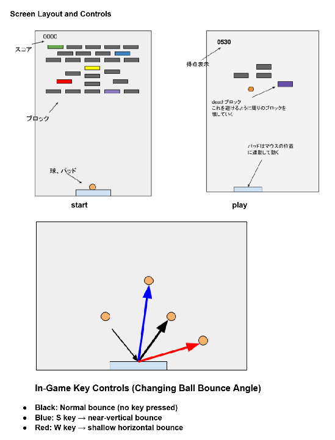

# 🎮 Block Breaker Game

A simple but fully playable **Block Breaker** game implemented in Python.  
This project was created to practice building an interactive application from scratch, focusing on **game loop design**, **collision handling**, and **clean code structure**.

---

## 🕹️ Game Overview

- Classic block‑breaking gameplay  
- Paddle movement controls the ball’s reflection angle  
- Clear all blocks to win  
- Lose if the ball falls below the paddle  
- Designed with readability and maintainability in mind

---

## 🖼️ Gameplay Screenshot



---

## 📁 Repository Structure

| File | Description |
|------|-------------|
| **Block Breaker 4.py** | Main Python script containing the full game implementation |
| **my_resource.pyxres** | Resource file used for game assets (images, sounds, etc.) |
| **Outline design.pdf** | High‑level design document describing the game structure and logic |
| **Self-assessment report.pdf** | Reflection on the development process and evaluation of the final product |
| **README.md** | Project documentation (this file) |

---

## 🛠️ Technologies & Concepts

- **Python**
- Game loop implementation  
- Collision detection  
- Paddle/ball physics  
- Resource management  
- Simple UI rendering

---

## 🚀 How to Run

1. Install Python (3.x recommended)
2. Clone this repository:
   ```bash
   git clone https://github.com/mzhayashi-create/Block-breaker-game

---
